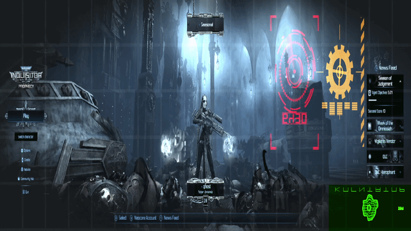

# Advanced ReShade Shader Suite

A high-performance collection of post-processing shaders for ReShade that rewrite game rendering pipelines in real-time without hurting frame rates.

---

## 🔥 Key Features

* **5×4 Affine Matrix Architecture:** Moves beyond simple 3×3 RGB color swaps to introduce per-channel translation offsets and custom luminance tracking.
* **Smart Luma Masking:** Uses dual-threshold parameters (`LumaMaskMin`/`LumaMaskMax`) to confine heavy color filters to specific brightness brackets.
* **Zero Performance Cost:** Runs mathematical calculations uniformly across the screen texture, requiring virtually zero GPU overhead.
* **Safety Clamping:** Built-in code blocks prevent color bleeding, artifacting, and white-out flashes during bright gameplay events.

---

## 🎨 Included Shaders & Presets

### 1. `SmartColorMatrix.fx` (Collection 1)
Features flagship atmospheric styles and a dedicated multi-pass selective masking loop:
* **Thermal Infrared:** Simulated military tracking vision using inverted cool palettes.
* **Selective Red Noir:** Drops the entire scene to grayscale while dynamically preserving deep reds.
* **Game Boy DMG:** Simulates a retro 4-bit handheld monochrome green matrix screen.
* **Cyberpunk Neon:** A vaporwave-heavy look that pushes colors into electric magenta and purple.
* *Includes: Cinematic Cross-Process, Noir Film, Wasteland Green, Cyberpunk Blue/Amber, Gothic Horror, Solarized Inversion, and Vaporwave Pastel.*

### 2. `SmartColorMatrixV2.fx` (Collection 2)
A completely separate, standalone companion file featuring 12 fresh visual presets:
* **Vintage Polaroid:** Mid-century film aesthetic with washed-out, warm highlights.
* **Blood Moon Horror:** Aggressive, high-contrast crimson rendering for survival titles.
* **Deep Sea Abyss:** Submerges the image into deep cobalt blues and muted aqua tones.
* **Golden Hour Sun:** Bathes game environments in intense warm sunset glows.
* *Includes: Toxic Swamp, Cyberpunk Green/Purple, Chroma Inversion, War Film, Monochrome Copper, Retrowave Sunset, Alien Atmosphere, and Frozen Tundra.*

### 3. Screen & Camera Transformers (`Master4.7zip` & Utilities)
Advanced geometry and screen-space utility shaders that drastically warp pixel data:
* **Police Lights Simulator:** Timed frequency loops that flash red and blue reflections over the frame.
* **Artistic Filters:** ComicPass and Kuwahara scripts that turn 3D scenes into comic books or oil paintings.
* **Motion Focus:** Limits peripheral vision and blurs edges automatically during fast camera turns.

---

## 🛠️ Quick Installation

1. Copy your `.fx` file into your game's shader folder: `...\reshade-shaders\Shaders\`
2. Boot your game and open the ReShade overlay (**Home** key by default).
3. Check the shader name to enable it, and use the **Gameplay Preset Profile** dropdown menu to switch styles instantly.

£ NEW!!! vampire mode

£ example of masking

# shaders and UI
useful  shader for reshade

originally developed for warhammer 40k inquisitor but use with any reshade install
-use DownsampleSSAO for better look and Colors or ColorMatrix

new ! noosphere work in progress (first 1.0 ver published in noo.fx)

NEW! astra and cog

industrial:

(psyker.fx - animated)

discojesus gif

inq2shader:

blue thermal (instead of standard red)

blue thermal enemies:

correct color matrix for blue thermal:

[ColorMatrix.fx]

