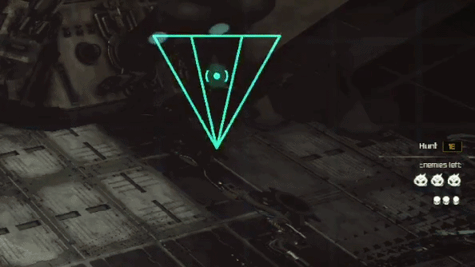

# shaders and UI
useful  shader for reshade

originally developed for warhammer 40k inquisitor but use with any reshade install
-use DownsampleSSAO for better look and Colors or ColorMatrix

new ! noosphere work in progress not published yet

video of 3 shaders in action:
https://www.youtube.com/watch?v=42Hp_9JzHyo

NEW! astra and cog

industrial:

(psyker.fx - animated)

discojesus gif

inq2shader:

blue thermal (instead of standard red)

blue thermal enemies:

correct color matrix for blue thermal:

[ColorMatrix.fx]

